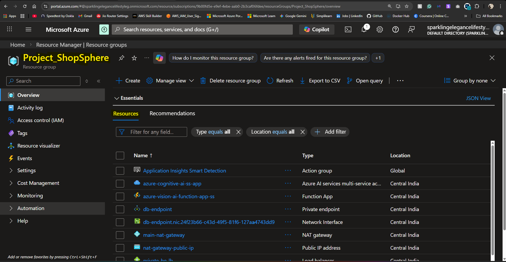
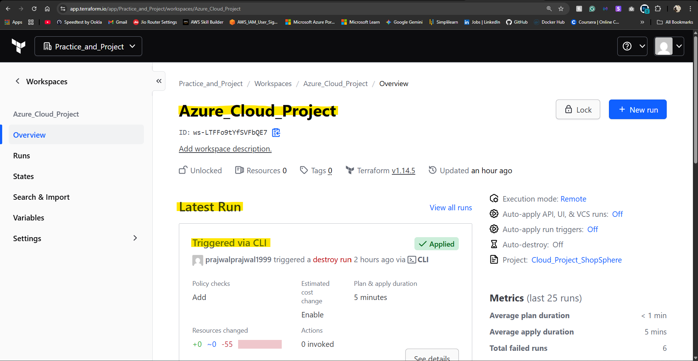
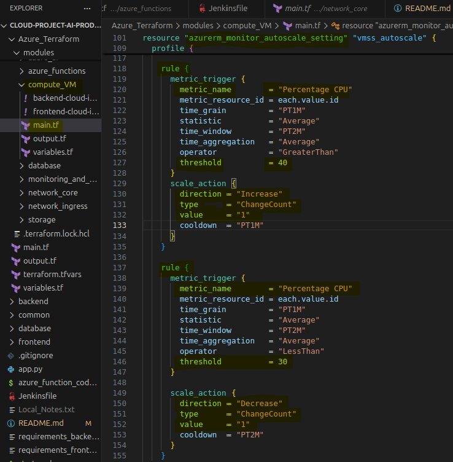
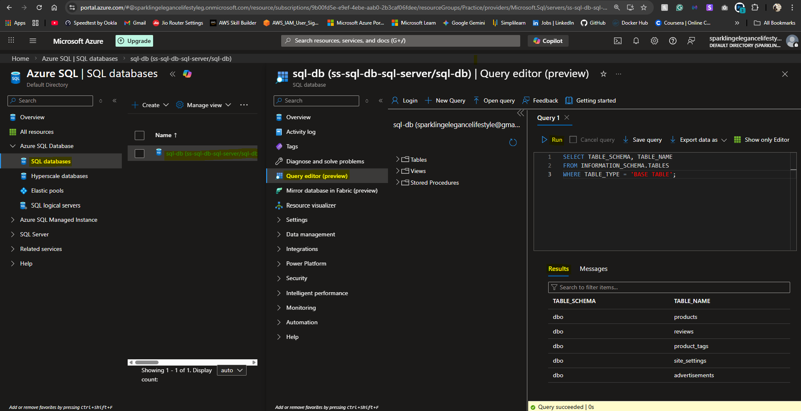
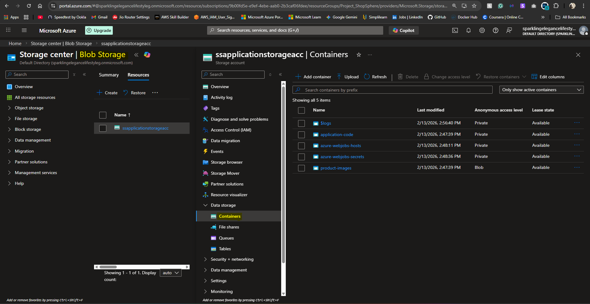
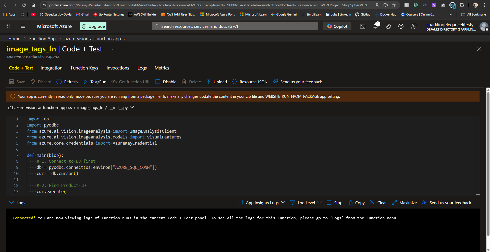
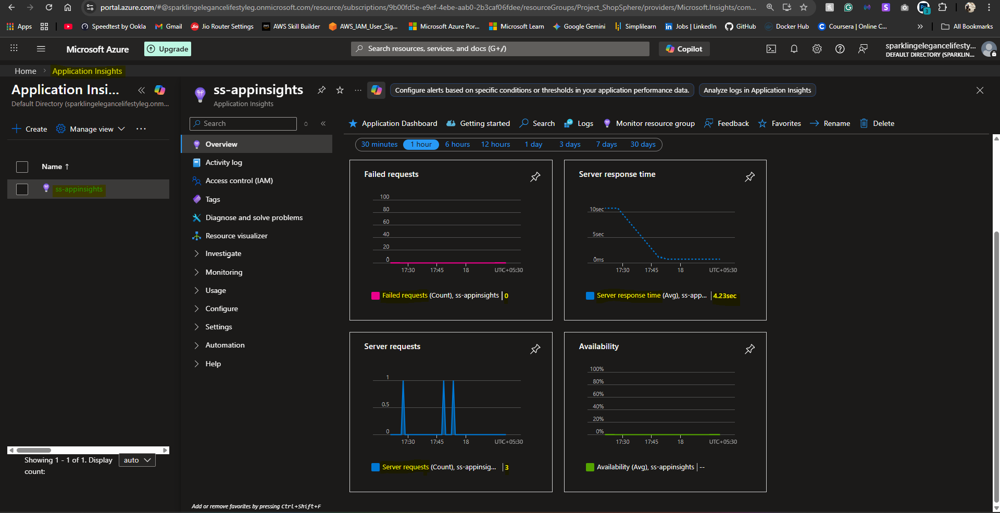
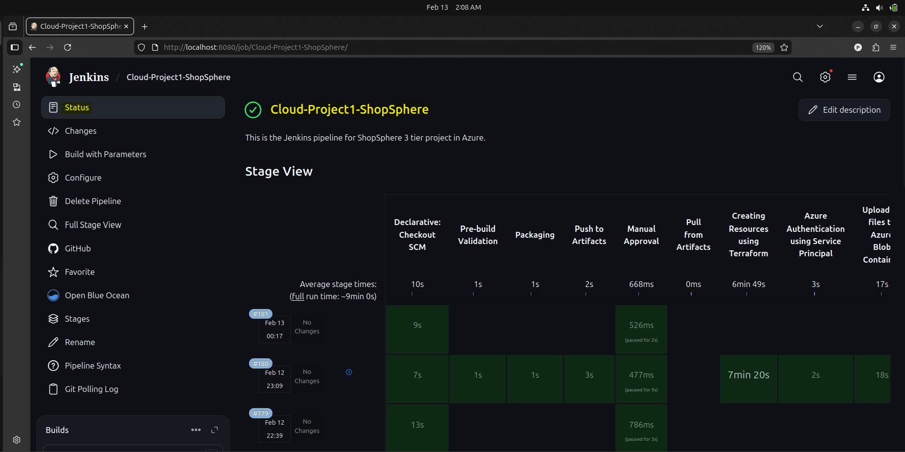
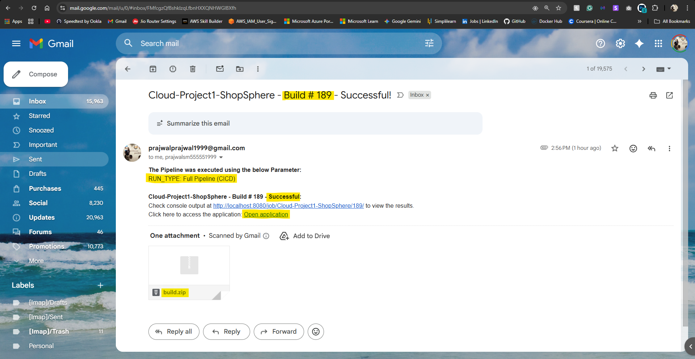
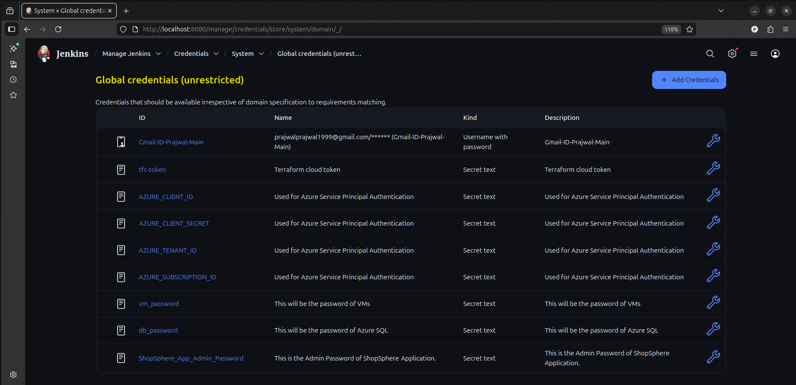

# ShopSphere - Azure 3-Tier Cloud Project

A fully automated, end-to-end cloud deployment of a product catalog web application on Microsoft Azure. Features a 3-tier architecture (Frontend VMs, Backend VMs, SQL Database), Infrastructure as Code with Terraform, Jenkins CI/CD pipeline, AI-powered image tagging and sentiment analysis, autoscaling, and comprehensive monitoring.

📂 **[Project Demo & Resources (Google Drive)](https://drive.google.com/drive/folders/1sYyktNkMw_YCGyhWtr0BsFAKUanTixTy)** — Contains the project demo video and related files.

## What This Project Demonstrates

- **3-Tier Architecture** on Azure (Frontend VMs, Backend VMs, SQL Database)
- **Infrastructure as Code** using Terraform with 8 modular components
- **Remote State Management** using Terraform Cloud
- **CI/CD Pipeline** using Jenkins with 4 deployment modes (CI, CD, CICD, De-provision)
- **Networking & Security** - VNet, Subnets, NSGs, NAT Gateway, Private Endpoints
- **Load Balancing** - Public and Internal Load Balancers with health probes
- **Autoscaling** - CPU-based scaling for VM Scale Sets
- **Serverless Computing** - Azure Functions with Blob trigger and VNet Integration
- **AI Integration** - Computer Vision for image tagging + Text Analytics for sentiment analysis
- **Monitoring & Alerts** - Log Analytics, Application Insights, CPU alerts with email notifications
- **Secure Credential Management** - Jenkins credentials, SAS tokens, Service Principal authentication

## The Web Application (ShopSphere)

The core of this project is **ShopSphere**, a fully functional, AI-enhanced product catalog web application built using **Python Flask**. It features a decoupled frontend-backend architecture designed to run on separate VM Scale Sets across different subnets.

**Pages:**
- **Home Page (`/`)** — Product catalog with a promotional carousel, category filtering (Electronics, Fashion, Kitchen, Lifestyle, Office), live search, and a responsive product grid with pricing in ₹
- **Product Details (`/product/<slug>`)** — Full product view with AI-generated image tags, customer reviews with sentiment analysis badges, review submission form, and a "You might also like" recommendation section
- **About Page (`/about`)** — Store's origin story with hero image, content sections, and an inspirational quote
- **Admin Login (`/admin-auth`)** — Secure admin portal using HTTP Basic Authentication to unlock product management across all pages
- **Health Check (`/health`)** — Lightweight endpoint used by load balancer probes and the Jenkins smoke test

**Admin Features:**
- Add new products (name, price, description, images) via a modal form on the home page
- Upload or change product images — triggers automatic AI tagging via Azure Function
- Delete products and moderate customer reviews

**AI Integration:**
- **Image Tagging** — Uploading a product image triggers an Azure Function that uses Computer Vision to auto-generate descriptive tags, powering search, filtering, and recommendations
- **Sentiment Analysis** — Every review is analyzed by Azure Text Analytics, displaying Positive/Neutral/Negative labels with confidence scores

**Tech:** Flask, Jinja2 Templates, Bootstrap 5, vanilla JavaScript, Azure SQL (5 tables), Azure Blob Storage for images.

For the complete breakdown of every page, API endpoint, database schema, and architecture details, see [**The Web Application — Detailed Description**](#the-web-application--detailed-description) below.

## Architecture Overview

The diagram below shows the main traffic flow and compute layer. Additional components like Blob Storage, Azure Functions, and monitoring are described in the sections below.

```
                        INTERNET
                            │
                    ┌───────▼───────┐
                    │  Public Load  │
                    │   Balancer    │
                    │   (Port 80)   │
                    └───────┬───────┘
                            │
         ┌──────────────────┴──────────────────┐
         │              VNet                   │
         │  ┌───────────────────────────────┐  │
         │  │       Frontend Subnet         │  │
         │  │  ┌─────────┐    ┌─────────┐   │  │
         │  │  │ VMSS    │    │ VMSS    │   │  │
         │  │  │(Flask)  │    │(Flask)  │   │  │
         │  │  └────┬────┘    └────┬────┘   │  │
         │  │       │              │        │  │
         │  └───────┼──────────────┼────────┘  │
         │          └──────┬───────┘           │
         │                 │                   │
         │         ┌───────▼───────┐           │
         │         │ Internal Load │           │
         │         │   Balancer    │           │
         │         └───────┬───────┘           │
         │                 │                   │
         │  ┌──────────────┼───────────────┐   │
         │  │       Backend Subnet         │   │
         │  │  ┌─────────┐    ┌─────────┐  │   │
         │  │  │ VMSS    │    │ VMSS    │  │   │
         │  │  │(API)    │    │(API)    │  │   │
         │  │  └────┬────┘    └────┬────┘  │   │
         │  │       │    NAT GW    │       │   │
         │  └───────┼──────────────┼───────┘   │
         │          └──────┬───────┘           │
         │                 │                   │
         │  ┌──────────────┼───────────────┐   │
         │  │       Database Subnet        │   │
         │  │  ┌─────────────────────────┐ │   │
         │  │  │  Private Endpoint       │ │   │
         │  │  │  (Azure SQL Database)   │ │   │
         │  │  └─────────────────────────┘ │   │
         │  └──────────────────────────────┘   │
         │                                     │
         │  ┌──────────────────────────────┐   │
         │  │       Function Subnet        │   │
         │  │  ┌─────────────────────────┐ │   │
         │  │  │  Azure Function (AI)    │ │   │
         │  │  │  + VNet Integration     │ │   │
         │  │  └───────────┬─────────────┘ │   │
         │  └──────────────┼───────────────┘   │
         │                 │                   │
         └─────────────────┼───────────────────┘
                           │
              ┌────────────┴────────────┐
              │                         │
     ┌────────▼────────┐      ┌─────────▼─────────┐
     │  Blob Storage   │      │  Azure Computer   │
     │ (Images + Code) │      │     Vision        │
     └─────────────────┘      └───────────────────┘
```

**Additional Components (not shown above):**
- Log Analytics Workspace for centralized logging
- Application Insights connected to the Function App
- Monitor Metric Alerts for CPU usage on VMSS
- Alert Action Group for email notifications
- Private DNS Zone for database name resolution
- Azure Text Analytics for review sentiment analysis

<!-- Resource Group Overview -->


## Detailed Description

This project is a complete end-to-end cloud deployment that brings together multiple Azure services, infrastructure automation, and a working web application. The main goal was to build something that mimics real-world production setups, not just a toy project.

### Infrastructure (Terraform)

All the Azure resources are provisioned using Terraform with a modular approach. Instead of putting everything in one giant file, the infrastructure code is split into 8 separate modules for things like networking, compute, database, storage, and so on. This makes it easier to maintain and reuse. The Terraform state is stored remotely in Terraform Cloud, so there's no risk of local state file issues when working from different machines.

The infrastructure includes:
- A Virtual Network with multiple subnets (frontend, backend, database, and function subnets), each with its own purpose and security rules
- Network Security Groups (NSGs) at both subnet and VM levels to control traffic flow
- A NAT Gateway attached to the backend subnet so those VMs can reach the internet for package updates and external API calls
- Private Endpoints for the database, meaning the SQL Server is not exposed to the public internet at all
- Private DNS Zone linked to the VNet for internal name resolution

**Subnet Configuration:**

| Subnet | CIDR | Access | Role | VMSS | Subnet NSG Source | VM NSG Source |
|--------|------|--------|------|------|-------------------|---------------|
| `public-fe` | `10.0.1.0/24` | Public | Frontend | Yes | Internet | Internet |
| `private-be` | `10.0.2.0/24` | Private | Backend | Yes | VirtualNetwork | `10.0.1.0/24` |
| `private-db` | `10.0.3.0/24` | Private | DB Endpoint | No | VirtualNetwork | — |
| `private-func` | `10.0.4.0/24` | Private | Function | No | `*` | — |

**Terraform Variables Reference:**

All configurable parameters are defined in `variables.tf`. Update `terraform.tfvars` to customize these values for your deployment. Sensitive variables (marked 🔒) are injected via Jenkins credentials and should not be committed to version control.

| Variable | Description | Type | Default |
|----------|-------------|------|---------|
| **General** | | | |
| `default_loc` | Azure region for all resources | `string` | `centralindia` |
| `rg_name` | Resource Group name | `string` | `Project_ShopSphere` |
| `static_resource_rg` | Resource Group for persistent resources (SQL Server, App Service Plan) | `string` | `Practice` |
| **Storage** | | | |
| `sa_name` | Storage Account name | `string` | `shopspheresa` |
| `sa_account_tier` | Storage Account tier | `string` | `Standard` |
| `sa_replication_type` | Storage Account replication type | `string` | `LRS` |
| `sa_access_tier` | Storage Account access tier | `string` | `Hot` |
| `sa_allow_public_access` | Allow public access to blob containers | `bool` | `false` |
| `code_container` | Blob container name for application code | `string` | `application-code` |
| `frontend_code` | Filename of the frontend ZIP in blob storage | `string` | `project1_shopsphere_frontend.zip` |
| `backend_code` | Filename of the backend ZIP in blob storage | `string` | `project1_shopsphere_backend.zip` |
| **Networking** | | | |
| `vnet_name` | Virtual Network name | `string` | `ss_main_vnet` |
| `vnet_cidr` | Virtual Network CIDR range | `string` | `10.0.0.0/16` |
| `subnet_details` | Map of subnet configs (CIDR, role, NSG rules, VMSS flag) | `map(object)` | — (Required) |
| `lb_pip_name` | Public IP name for the Load Balancer | `string` | `public-subnet-lb-pip` |
| `lb_pip_sku` | SKU for the Load Balancer Public IP | `string` | `Standard` |
| **Compute (VMSS)** | | | |
| `vm_un` | VM admin username | `string` | — (Required) |
| `vm_pwd` 🔒 | VM admin password | `string` | — (Sensitive) |
| `vm_sku` | VM instance size | `string` | `Standard_B2pls_v2` |
| `vm_os_publisher` | OS image publisher | `string` | `Canonical` |
| `vm_os_offer` | OS image offer | `string` | `0001-com-ubuntu-server-jammy` |
| `vm_os_sku` | OS image SKU | `string` | `22_04-lts-arm64` |
| `vm_os_version` | OS image version | `string` | `latest` |
| `vmss_min_capacity` | Minimum VMSS instances | `number` | `1` |
| `vmss_max_capacity` | Maximum VMSS instances | `number` | `3` |
| `vmss_default_capacity` | Default VMSS instances | `number` | `1` |
| **Database** | | | |
| `db_un` | SQL Server admin username | `string` | — (Required) |
| `db_pwd` 🔒 | SQL Server admin password | `string` | — (Sensitive) |
| `sql_server_name` | Azure SQL Server name | `string` | `shopsphere-sql-db` |
| `sql_db_name` | Azure SQL Database name | `string` | `sql-db` |
| `db_sku_name` | SQL Database SKU | `string` | `Basic` |
| `db_max_size_gb` | SQL Database max size (GB) | `number` | `2` |
| **Application** | | | |
| `app_admin_un` | ShopSphere app admin username | `string` | — (Required) |
| `app_admin_pwd` 🔒 | ShopSphere app admin password | `string` | — (Sensitive) |
| **Azure Functions** | | | |
| `function_app_name` | Azure Function App name | `string` | `azure-ai-function-app` |
| `func_plan_name` | App Service Plan name for Functions | `string` | — (Required) |
| `func_python_version` | Python version for the Function App | `string` | `3.12` |
| **AI Services** | | | |
| `ai_name` | Azure Cognitive Services account name | `string` | `azure-ai` |
| `ai_sku` | Cognitive Services SKU | `string` | `S0` |
| **Monitoring & Alerts** | | | |
| `la_workspace_name` | Log Analytics Workspace name | `string` | `ss-la-workspace` |
| `la_sku` | Log Analytics SKU | `string` | `PerGB2018` |
| `la_retention` | Log Analytics retention (days) | `number` | `30` |
| `app_insights_name` | Application Insights resource name | `string` | `ss-appinsights` |
| `alert_action_group_name` | Monitor Action Group name | `string` | `ss-ma-group` |
| `alert_email` | Email address for alert notifications | `string` | `prajwalprajwal1999@gmail.com` |

<!-- Terraform Cloud Workspace -->


### Compute and Autoscaling

The application runs on two VM Scale Sets. One for the frontend (serves the UI) and one for the backend (handles API requests). Both scale sets run Ubuntu 22.04 LTS and are configured with autoscaling rules based on CPU usage. If CPU goes above 80%, a new instance spins up. If it drops below 30%, an instance gets removed. This keeps costs in check while handling traffic spikes.

Each VM is provisioned using cloud-init scripts that do a lot of heavy lifting—install Python, set up a virtual environment, install the ODBC Driver 18 for SQL Server connectivity, download the zipped application code from Blob Storage using a SAS token, and configure the Flask app as a SystemD service. The app runs under Gunicorn (a production WSGI server) with 4 workers. SystemD handles restarts if the process crashes. All of this happens automatically, no SSH required after deployment.

<!-- VMSS Autoscaling Rules -->


### Networking and Load Balancing

Traffic flows through two load balancers. The public-facing load balancer sits in front of the frontend VMs and accepts requests on port 80. It forwards traffic to the Flask apps running on port 8000. The frontend then talks to the backend through an internal load balancer, which is not exposed to the internet. This separation keeps the backend layer protected.

Health probes are configured on both load balancers to check if the Flask apps are responding. If a VM becomes unhealthy, it stops receiving traffic until it recovers.

### Database

The project uses Azure SQL Database. The SQL Server has public network access disabled, so the only way to reach it is through a Private Endpoint. The VMs connect to the database using a private IP address within the VNet, and DNS resolution is handled by a Private DNS Zone. This is a common pattern for securing databases in production.

<!-- Database and Tables -->


### Storage

An Azure Storage Account is used for two things. First, there's a container called `application-code` that holds the zipped application code (uploaded by the CI/CD pipeline). The VMs download this code during startup using a SAS token. Second, there's a `product-images` container that stores product images uploaded through the app. This container is publicly accessible so images can be displayed on the frontend.

<!-- Blob Storage Containers -->


### Azure Functions and AI Integration

This is where it gets interesting. The project uses Azure Cognitive Services in two ways:

**1. Image Tagging (via Azure Function):** Whenever a new product image is uploaded to the Blob container, it triggers an Azure Function. The function reads the image, sends it to Azure Computer Vision API, and gets back a list of tags describing what's in the image (up to 8 tags). These tags are saved to the database automatically and used for product recommendations.

**2. Sentiment Analysis (via Backend API):** When users submit product reviews, the backend calls Azure Text Analytics API to analyze the sentiment. Each review gets a sentiment label (Positive, Neutral, Negative) and a score. This is stored alongside the review in the database.

The Azure Function runs on a Linux-based App Service Plan and is integrated into the VNet through VNet Integration. It also connects to Application Insights for logging and monitoring. The function code is deployed separately using Azure CLI during the pipeline run. There's retry logic built in—if the database hasn't been updated with the new product yet (race condition), the function retries automatically.

<!-- Azure Function App and Application Insights -->


### Monitoring and Alerts

A Log Analytics Workspace collects logs from the various resources. Application Insights is attached to the Function App to track invocations, errors, and performance. There's also an Alert Action Group configured to send email notifications if CPU usage on any VMSS exceeds 70%. This gives visibility into what's happening without needing to constantly check the portal.

<!-- Monitoring Dashboard -->


### CI/CD Pipeline (Jenkins)

The Jenkinsfile defines a multi-stage pipeline that handles everything from code validation to deployment and teardown. Depending on the selected mode, the pipeline can:
- Just validate and package the code (CI only)
- Deploy infrastructure and application (CD only)
- Do both end-to-end (Full CICD)
- Tear down everything (De-provision)

The pipeline uses a Service Principal for Azure authentication. Credentials like Terraform Cloud tokens, Azure client secrets, and app passwords are stored securely in Jenkins and injected as environment variables during the run. There's also a manual approval stage before any infrastructure changes are applied, so nothing gets deployed by accident.

After deployment, a smoke test runs to verify the application is actually responding. If everything looks good, a notification email is sent out.

<!-- Jenkins Pipeline Stages -->


## The Web Application — Detailed Description

This section provides a comprehensive breakdown of every page, feature, API, and technical detail of the ShopSphere web application.

### 1. Pages & User-Facing Features

#### Home Page (`/`)


The main landing page of ShopSphere. It features:
- **Promotional Carousel** — An auto-rotating banner at the top showcasing promotional ads (Tech Fest Sale, Fashion Week, Kitchen Essentials, Lifestyle Picks, Office Essentials) with gradient backgrounds, badge labels, and category-specific call-to-action buttons.
- **Category Navigation Bar** — A dark-themed horizontal bar with quick-filter links: All, Electronics, Fashion, Kitchen, Lifestyle, and Office. Clicking a category instantly filters the product grid by AI-generated tags.
- **Product Grid** — A responsive grid displaying all products dynamically loaded via the API. Each product card shows the thumbnail image, product name, current price in Indian Rupee format (₹), original price with strikethrough, and the calculated discount percentage.
- **Live Search** — A search input in the navbar that filters products in real-time as you type, searching across product names and descriptions.
- **Admin Controls** (visible when logged in as admin) — An "+ Add Product" button in the navbar and a "Delete" button on each product card.

#### Product Details Page (`/product/<slug>`)


A detailed view of an individual product, accessed by clicking any product card. It includes:
- **Product Image** — A large display area showing the product's image (sourced from Azure Blob Storage in cloud or local static files).
- **Product Information** — The full product name, description, current price, original price, and discount percentage.
- **AI-Generated Tags** — Tags assigned by Azure Computer Vision are displayed as minimal badges below the product info. These tags describe the image content (e.g., "electronics", "headphones", "gadget").
- **Customer Reviews Section** — All submitted reviews are listed with the reviewer's name, review text, a color-coded sentiment badge (Positive in green, Neutral/Negative in grey), and an average sentiment score across all reviews.
- **Review Submission Form** — Any user can submit a review by entering their name and review text. Upon submission, Azure Text Analytics instantly analyzes the sentiment and assigns a label and confidence score.
- **"You Might Also Like" Recommendations** — A horizontally scrollable row of up to 5 recommended products that share the same AI-generated tags as the currently viewed product.
- **Admin Controls** (visible when logged in) — An image upload section that lets admins change the product image. Uploading a new image streams it to Azure Blob Storage and triggers the AI tagging Azure Function. Admins can also delete individual reviews.

#### About Page (`/about`)


A content page that tells the story behind ShopSphere. It displays:
- A hero section with a title ("Our Story"), subtitle, and a hero banner image.
- Two content cards: "How We Started" and "Our Passion", each with descriptive text.
- An inspirational design quote blockquote.

#### Admin Login (`/admin-auth`)


A secure entry point for store administrators. It uses HTTP Basic Authentication — when an admin navigates to this URL, the browser prompts for a username and password. Valid credentials (set via environment variables `ADMIN_USERNAME` and `ADMIN_PASSWORD`) grant admin access for the session, enabling product management controls across all pages. Admins can log out via the "Exit as Admin" button visible in the navbar.

#### Health Check (`/health`)

A lightweight endpoint that returns a plain `200 OK` response. This is used by both the Frontend and Backend Azure Load Balancer health probes, as well as the Jenkins pipeline smoke test to verify the application is running after deployment.

### 2. Admin Portal & Product Management

<!-- Admin Add Product Modal -->


When logged in as an admin, the application unlocks a full product management interface:

- **Add Product** — A modal form on the home page lets admins create new products by entering the name, original price, discounted price, description, and product image. The image is uploaded to Azure Blob Storage immediately after product creation.
- **Upload / Change Product Image** — On the product details page, admins can upload a new image for any existing product. The upload goes to Azure Blob Storage, old AI tags are cleared, and the Blob trigger fires the Azure Function to generate fresh tags from the new image.
- **Delete Product** — Each product card on the home page shows a delete button for admins. Deleting a product removes its associated tags, reviews, and the product itself from the database.
- **Delete Reviews** — On the product details page, admins can delete individual reviews (e.g., offensive or spam content).

### 3. REST APIs (Backend)

The backend exposes RESTful JSON APIs that power all frontend interactions:

| Endpoint | Method | Auth | Description |
|----------|--------|------|-------------|
| `/api/products` | GET | Public | Fetches products with pagination (`limit`, `offset`), fuzzy search (`q`), and tag-based filtering (`tag`). Returns products with their AI tags attached. |
| `/api/products/<id>` | GET | Public | Returns full product details including description, price, AI tags, and all reviews with sentiment data. |
| `/api/products/<id>/reviews` | POST | Public | Submits a new review. The backend instantly calls Azure Text Analytics to analyze sentiment before saving. |
| `/api/products/<id>/recommendations` | GET | Public | Returns up to 5 products that share the same AI-generated tags (tag-based recommendation engine). |
| `/api/ads` | GET | Public | Returns promotional advertisement banners for the home page carousel. |
| `/api/reviews/<id>` | DELETE | Admin | Deletes a specific review (admin-only). |
| `/api/products` | POST | Admin | Creates a new product with name, price, description, and optional manual tags. |
| `/api/products/<id>/image` | POST | Admin | Uploads a product image to Azure Blob Storage and clears old tags for AI re-tagging. |
| `/api/products/<id>` | DELETE | Admin | Deletes a product along with all its tags and reviews. |

The frontend proxies all `/api/*` requests to the backend through an internal API proxy route, forwarding the admin session header (`X-Admin`) for authentication.

### 4. AI & Cognitive Services Integration

The application integrates two Azure Cognitive Services directly into its data pipeline:

**Automated Image Tagging (Azure Computer Vision + Azure Function):**
When an admin uploads a product image, it is stored in Azure Blob Storage. This triggers a serverless Azure Function (Blob trigger) that reads the image, sends it to the Azure Computer Vision API, and receives up to 8 descriptive tags (e.g., "electronics", "smartphone", "gadget"). The function writes these tags directly into the `product_tags` table in Azure SQL. These tags are then used for category filtering on the home page, the tag badges on the product details page, and the "You might also like" recommendation engine.

<!-- Image Tagging -->


**Review Sentiment Analysis (Azure Text Analytics):**
Every time a user submits a product review, the backend API instantly sends the review text to Azure Text Analytics for sentiment analysis. The API returns a sentiment label (`Positive`, `Neutral`, or `Negative`) and a confidence score. These are stored alongside the review in the database and displayed as color-coded badges next to each review. An average sentiment score is also calculated and shown at the top of the reviews section.

<!-- Sentiment Analysis Badges on Reviews -->


### 5. Database Schema

The application manages 5 tables, created automatically on first startup if they don't exist. Sample data is seeded on first run when tables are empty.

| Table | Purpose | Key Columns |
|-------|---------|-------------|
| `products` | Stores the product catalog | `id`, `name`, `description`, `price`, `original_price`, `thumbnail_url` |
| `reviews` | Stores user reviews with AI sentiment | `id`, `product_id`, `reviewer`, `review_text`, `sentiment_score`, `sentiment_label` |
| `product_tags` | Stores AI-generated tags per product | `id`, `product_id`, `tag_name` |
| `advertisements` | Stores promotional banners for the carousel | `id`, `badge`, `title`, `subtitle`, `button_text`, `category`, `image_url`, `gradient` |
| `site_settings` | Stores global app configuration (footer text, contact info) | `key`, `value` |

### 6. Frontend Technology

The frontend is built with:
- **Jinja2 Templates** — Server-side rendered HTML pages (3 page templates + 2 reusable components: navbar and footer)
- **Bootstrap 5** — Responsive grid, cards, modals, carousel, dropdowns, and form components
- **JavaScript** — Dynamic product loading, live search, review submission, image uploads, and admin actions (no frontend framework, pure vanilla JS)
- **Inter Font** (Google Fonts) — Clean, modern typography across all pages
- **Indian Currency Formatting** — Prices displayed in ₹ with Indian-style comma grouping (e.g., ₹1,00,000) via a custom Jinja2 filter

### 7. Split-Architecture Design

The application is designed to run as a single codebase that conditionally loads modules based on the deployment context:
- **Frontend VMSS** — Loads only `routes_ui.py` (UI pages + API proxy). All API calls are forwarded to the backend via the internal load balancer.
- **Backend VMSS** — Loads only `routes_api.py` and `routes_admin.py` (REST APIs + database access). Connects directly to Azure SQL via Private Endpoint.
- **Local Development** — Both frontend and backend modules load together, and the app runs as a single Flask instance on port 5000.

## Project Structure

```
├── Azure_Terraform/          # Infrastructure as Code
│   ├── main.tf               # Main config with 8 modules
│   ├── variables.tf          # All configurable parameters
│   ├── terraform.tfvars      # Variable values
│   ├── output.tf             # Terraform outputs (public IP)
│   └── modules/
│       ├── network_core/     # VNet, Subnets, NSGs, NAT Gateway
│       ├── compute_VM/       # VM Scale Sets + Autoscaling + cloud-init
│       ├── database/         # Azure SQL Server + Private Endpoint
│       ├── storage/          # Blob Storage + SAS tokens
│       ├── azure_ai/         # Cognitive Services
│       ├── azure_functions/  # Serverless function + VNet Integration
│       ├── network_ingress/  # Load Balancers (Public + Internal)
│       └── monitoring_and_alerts/  # Log Analytics, App Insights, Alerts
│
├── Azure_Function/           # Serverless AI tagging function
│   ├── host.json             # Function app configuration
│   ├── requirements.txt      # Python dependencies
│   └── image_tags_fn/        # Blob-triggered function code
│
├── backend/                  # Backend Flask API
│   ├── routes_api.py         # Public API endpoints
│   └── routes_admin.py       # Admin API endpoints
│
├── frontend/                 # Frontend Flask App
│   ├── routes_ui.py          # UI routes
│   ├── static/               # CSS, JS, images
│   └── templates/            # Jinja2 HTML templates
│
├── database/                 # Database layer
│   ├── db.py                 # Connection + helpers
│   └── seed_data.py          # Sample data seeding
│
├── common/                   # Shared utilities
│   └── utils.py              # AI helpers, image upload, formatters
│
├── Jenkinsfile               # CI/CD Pipeline (12 stages)
├── app.py                    # Flask application entry point
├── requirements_frontend.txt # Frontend Python dependencies
├── requirements_backend.txt  # Backend Python dependencies
└── .gitignore                # Git ignore rules
```

## CI/CD Pipeline

The Jenkins pipeline has 4 modes:

| Mode | What It Does |
|------|--------------|
| Clone and Package (CI) | Validates code, creates zip artifacts |
| Deploy Infrastructure (CD) | Provisions Azure resources, deploys app |
| Full Pipeline (CICD) | Complete end-to-end deployment |
| De-provision | Tears down all infrastructure |

**Pre-build Action (All modes):**
- Clone code from SCM (Git repository)

---

### Clone and Package (CI)
1. Pre-build Validation (checks all required files exist)
2. Packaging (creates frontend and backend zip files)
3. Push to Artifacts (archives zips in Jenkins)

---

### Deploy Infrastructure and Application (CD)
1. Pull from Artifacts (retrieves zips from Jenkins)
2. Manual Approval (human gate before infra changes)
3. Creating Resources using Terraform (init, validate, plan, apply)
4. Azure Authentication using Service Principal
5. Uploading files to Azure Blob Container (code + product images)
6. Configuration and Deployment to Azure Function
7. Logout from Service Principal
8. Smoke Testing (health check + page content verification)

---

### Full Pipeline (CICD)
1. Pre-build Validation (checks all required files exist)
2. Packaging (creates frontend and backend zip files)
3. Push to Artifacts (archives zips in Jenkins)
4. Manual Approval (human gate before infra changes)
5. Creating Resources using Terraform (init, validate, plan, apply)
6. Azure Authentication using Service Principal
7. Uploading files to Azure Blob Container (code + product images)
8. Configuration and Deployment to Azure Function
9. Logout from Service Principal
10. Smoke Testing (health check + page content verification)

---

### De-provision Infrastructure and Application
1. Manual Approval
2. Removing the complete Infrastructure, Resources and Application (terraform destroy)

---

**Post-build Actions (All modes):**
- Email notification with build status and direct app link
- Workspace cleanup

<!-- Build Notification Email -->


## Azure Resources Created

- Resource Group
- Virtual Network with 4 Subnets (frontend, backend, database, function)
- Network Security Groups (subnet-level and VM-level)
- NAT Gateway + Public IP (for backend internet access)
- 2x VM Scale Sets (Frontend + Backend) with Autoscaling rules
- Public IP for Load Balancer (application entry point)
- Public Load Balancer with health probes and rules
- Internal Load Balancer with health probes and rules
- Azure SQL Database
- Private Endpoint for SQL Server
- Private DNS Zone + VNet Link (database name resolution)
- Storage Account with 2 Blob containers (application-code, product-images)
- SAS Token for secure code download
- Azure Function App (Blob trigger + VNet Integration)
- Azure Cognitive Services (Computer Vision + Text Analytics)
- Log Analytics Workspace
- Application Insights
- Monitor Metric Alerts (CPU threshold alerts)
- Alert Action Group (email notifications)

## Environment Variables

These are injected into VMs via cloud-init and written to `/etc/environment`.

**Common (Both Tiers):**

| Variable | Description |
|----------|-------------|
| `FLASK_SECRET` | Secret key for Flask session management |
| `AZURE_SQL_CONN` | ODBC connection string for Azure SQL |

**Frontend VMSS Only:**

| Variable | Description |
|----------|-------------|
| `ADMIN_USERNAME` | App admin login username |
| `ADMIN_PASSWORD` | App admin login password |
| `BACKEND_API_URL` | Internal load balancer URL to reach backend |

**Backend VMSS Only:**

| Variable | Description |
|----------|-------------|
| `AZURE_AI_ENDPOINT` | Azure Cognitive Services endpoint |
| `AZURE_AI_KEY` | Azure Cognitive Services API key |
| `AZURE_STORAGE_CONNECTION_STRING` | Blob storage connection string |
| `STORAGE_ACCOUNT_NAME` | Storage account name for image uploads |

## How to Deploy

### Prerequisites
1. **Azure Subscription** with permissions to create resources
2. **Azure Service Principal** with Contributor role
3. **Terraform Cloud Account** with a workspace configured
4. **Jenkins Server** with required plugins (Pipeline, Git, Credentials)

### Jenkins Credentials Setup
Add the following credentials in Jenkins (Manage Jenkins → Credentials):

<!-- Jenkins Credentials Page -->


| Credential ID | Type | Description |
|---------------|------|-------------|
| `tfc-token` | Secret text | Terraform Cloud API token |
| `AZURE_CLIENT_ID` | Secret text | Service Principal App ID |
| `AZURE_CLIENT_SECRET` | Secret text | Service Principal password |
| `AZURE_TENANT_ID` | Secret text | Azure AD Tenant ID |
| `AZURE_SUBSCRIPTION_ID` | Secret text | Azure Subscription ID |
| `vm_password` | Secret text | Password for VM admin user |
| `db_password` | Secret text | Password for Azure SQL admin |
| `ShopSphere_App_Admin_Password` | Secret text | App admin panel password |

### Deployment Steps
1. **Fork/Clone the repository** to your Git server
2. **Configure Terraform Cloud** - Create workspace, link to VCS, set execution mode to "Local"
3. **Update `terraform.tfvars`** - Modify resource names, location, and other parameters as needed
4. **Create Jenkins Pipeline** - Point to your repository's Jenkinsfile
5. **Run the Pipeline** - Select "Full Pipeline (CICD)" mode
6. **Approve the deployment** - Click "Proceed" at the manual approval stage
7. **Access the App** - Use the public IP shown in Terraform output or email notification

## Quick Test

After deployment:
1. Open the public load balancer IP in browser
2. Browse products on homepage (filter by category ads)
3. Search for products using the search bar
4. Click on a product to view details and AI-generated tags
5. Check the "You might also like" section (tag-based recommendations)
6. Submit a review → Sentiment analysis labels it as Positive/Neutral/Negative
7. Login at `/admin-auth` with admin credentials
8. Add a new product with an image → AI tags are auto-generated within seconds
9. Edit or delete existing products from admin panel
10. Verify health endpoint: `http://<public-ip>/health` returns "OK"

## Tech Stack

| Category | Technology |
|----------|------------|
| **Cloud Platform** | Microsoft Azure |
| **Infrastructure as Code** | Terraform + Terraform Cloud |
| **CI/CD** | Jenkins |
| **Compute** | Azure VM Scale Sets (Ubuntu 22.04) |
| **Database** | Azure SQL Database |
| **Storage** | Azure Blob Storage |
| **Serverless** | Azure Functions (Python) |
| **AI Services** | Azure Computer Vision, Azure Text Analytics |
| **Monitoring** | Log Analytics, Application Insights |
| **Backend** | Python Flask + Gunicorn |
| **Frontend** | Jinja2 Templates, Bootstrap, JavaScript |
| **Networking** | VNet, NSG, NAT Gateway, Load Balancers, Private Endpoints |

## Author

| **Name** | Prajwal SM |
|---|---|
| **LinkedIn** | [linkedin.com/in/prajwal-sm](https://www.linkedin.com/in/prajwal-sm/) |
| **Email** | prajwalprajwal1999@gmail.com |
